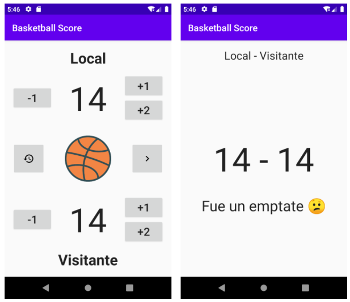

# Basketball Score

Al desarrollar esta aplicación practicarás los siguientes temas de Android:

- Views en Android.
- Android Layouts.
- Explicit intents.
- Data Binding.
- Recursos String.

Basketball Score es una aplicación para llevar un registro de la puntuación en partidos de basketball. La app terminada luce así:

Como puedes ver la aplicación tiene dos pantallas, una pantalla principal (MainActivity) donde puedes agregar o quitar puntos en caso de que agregues de más, con el botón ubicado a la izquierda del balón puedes restablecer el marcador y el botón del lado derecho te permite ver un resultado en la pantalla de score (ScoreActivity).

##### Tu misión es cumplir con los siguientes objetivos:

- Desarrollar los diseños de ambas pantallas.
- Que cuando hagas clic en los botones +1 y +2 sume los puntos correspondientes para el equipo correspondiente.
- Que cuando hagas clic en el botón -1, reste un punto para el equipo correspondiente.
- Que cuando hagas clic en el icono del reloj, restablezca ambos marcadores a cero.
- Cuando hagas clic en el botón de la flecha hacia la derecha, abra la pantalla de detalles.
- La pantalla de detalles debe mostrar el marcador y un texto de resultado como el que se ve en la imagen de la derecha, el resultado debe ser uno de los siguientes “¡Ganó el equipo local!”, “¡Ganaron los visitantes!” o “Fue un empate 😕”.

##### Restricciones y corner cases:

Estas son algunas restricciones y casos especiales que hay que tomar en cuenta.

- Puedes usar cualquier tipo de Layout para realizar los diseños.
- La mínima puntuación posible es 0, si el marcador es 0 y se da clic en el botón de -1, la puntuación no debería bajar más.
- Debes usar data binding para manejar los views en la Activity.
- Al pasar datos de una Activity a otra, usa llaves con constantes.

¡Mucha suerte!